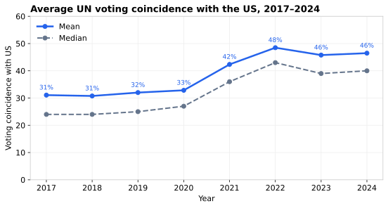
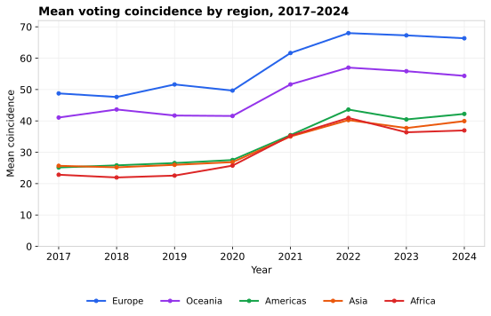
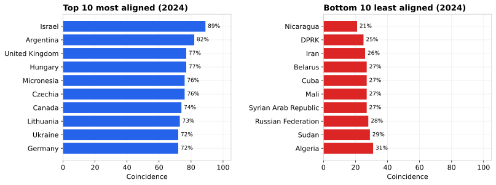
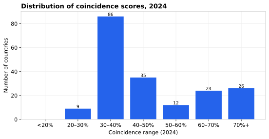
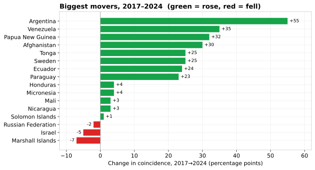

# UN General Assembly Voting Coincidence with the United States

An analysis of how closely each UN member state's votes in the General Assembly
align with those of the United States, based on the U.S. State Department's annual
*Voting Practices in the United Nations* reports.

> Voting coincidence provides the "comparison of the overall voting practices in the principal
> bodies of the United Nations" requested by Congress. Because the United Nations acts on so many
> diverse issues, the voting record of a UN member state during the General Assembly (193 members)
> and Security Council provides insight into a country's orientation in world arenas: where it
> stands, with whom it stands (at least in a UN context), and for what purpose. Voting coincidence
> data refers only to the UN context and does not take into account support for U.S. policy
> positions in other multilateral fora or bilateral contexts. The vast majority of resolutions are
> approved by consensus, with no recorded vote. Overall correlation between countries is highly
> dependent on the types of resolutions that come to a vote — for example, in the UNGA,
> Israeli-Palestinian issues account for roughly **one-quarter** of resolutions adopted with a vote,
> which skews the metric for countries that oppose those resolutions.

**Source:** <https://www.state.gov/voting-practices-in-the-united-nations/>

---

## Scope and methodology

This analysis covers **2017–2024 only**, deliberately excluding the 2013–2016 data. In 2017 the
State Department **changed its methodology**: abstentions were brought into the calculation, and a
new *Partial* category was introduced. Each country–year now sorts votes into four buckets:

| Column | Meaning |
|:--|:--|
| **SAME** | Times the country and the U.S. voted the same way |
| **OPPOSE** | Times they voted opposite |
| **PARTIAL** | Times exactly one of them abstained (counts as a half-match) |
| **ABSENT** | Times the country did not vote (excluded from the score) |

The **voting coincidence** is `(SAME + 0.5 × PARTIAL) / (SAME + OPPOSE + PARTIAL)`.

Before 2017 the third column was *Abstain* (the country's own abstentions, **excluded** from the
score), so pre-2017 figures are **not comparable** to later years and are left out of this analysis.
The raw 2013–2016 files remain in the repo for reference.

> **Data correction:** the previously committed `un-coincidence-2017.csv` had been extracted from
> the wrong table (~21 votes per country; Canada at 98%). It has been re-extracted from the 2017
> report's *All Countries (Alphabetical)* overall table — e.g. Israel 80/1/9 = 94%, Canada
> 53/17/23 = 69% — and the per-country coincidence now reconciles to the official 31% overall rate.

---

## The big picture

Average coincidence with the U.S. has **risen sharply** since 2017, climbing from ~31% to a peak
of ~48% in 2022 before leveling off near 46%. The gap between mean and median is small, so the
shift reflects a broad move across most countries rather than a few outliers.

| Year | Mean | Median |
|:--|---:|---:|
| 2017 | 31% | 24% |
| 2018 | 31% | 24% |
| 2019 | 32% | 25% |
| 2020 | 33% | 27% |
| 2021 | 42% | 36% |
| 2022 | 48% | 43% |
| 2023 | 46% | 39% |
| 2024 | 46% | 40% |

The jump in 2021–2022 lines up with the wave of UNGA votes condemning Russia's invasion of Ukraine,
on which a large majority voted with the U.S.

## By region

Every region trended upward, but the spread is wide: **Europe** (~67%) and **Oceania** (~54%) sit
far above **Africa**, **Asia**, and the **Americas** (all clustered in the high-30s).

*Regions follow a five-continent grouping by ISO code; transcontinental states (e.g. Turkey,
Russia, Cyprus, the Caucasus) are assigned to a single region, which affects regional averages.*

## Most and least aligned, 2024

Israel remains the single closest vote to the U.S. The least-aligned cluster — Nicaragua, DPRK,
Iran, Belarus, Cuba, Russia, Syria — is stable year to year.

## Distribution, 2024

Most countries fall in the 30–50% band; alignment above 60% is largely confined to Europe, the
Anglosphere, and a few Pacific states.

## Biggest movers, 2017 → 2024

The rise is near-universal: **189 of 192 countries** were more aligned with the U.S. in 2024 than
in 2017. Only **three** declined — the Marshall Islands (−7 pts), Israel (−5 pts, already near the
ceiling), and Russia (−2 pts).

**Argentina** is the standout, leaping +55 points (27% → 82%) — consistent with President Milei's
sharp pro-U.S./pro-Israel realignment. Venezuela (+35) and several Pacific and Latin American states
also moved up substantially.

| Largest increases | 2017 | 2024 | Change | | Only decliners | 2017 | 2024 | Change |
|:--|---:|---:|---:|:-:|:--|---:|---:|---:|
| Argentina | 27% | 82% | +55 | | Marshall Islands | 63% | 56% | −7 |
| Venezuela | 16% | 51% | +35 | | Israel | 94% | 89% | −5 |
| Papua New Guinea | 28% | 60% | +32 | | Russian Federation | 30% | 28% | −2 |
| Afghanistan | 21% | 51% | +30 | | | | | |
| Tonga | 28% | 53% | +25 | | | | | |
| Sweden | 46% | 71% | +25 | | | | | |

## Most consistent allies and adversaries

Averaging each country's coincidence across all eight years (2017–2024) smooths out single-year
noise and shows who is *durably* aligned.

| Most aligned (8-yr avg) | Avg | | Least aligned (8-yr avg) | Avg |
|:--|---:|:-:|:--|---:|
| Israel | 92% | | Syrian Arab Republic | 17% |
| Micronesia | 74% | | Nicaragua | 18% |
| Canada | 72% | | Iran | 19% |
| United Kingdom | 69% | | DPRK | 20% |
| Australia | 69% | | Cuba | 21% |
| Hungary | 66% | | Zimbabwe | 24% |
| France | 65% | | Turkmenistan | 24% |
| Czechia | 65% | | Belarus | 24% |
| Marshall Islands | 65% | | Bolivia | 24% |
| Lithuania | 63% | | China | 25% |

## Most volatile

Countries whose alignment swung the most year to year (standard deviation of coincidence,
2017–2024). High volatility often signals a change of government or foreign-policy posture.

| Country | Std. dev. |
|:--|---:|
| Argentina | 17 pts |
| Venezuela | 16 pts |
| Liberia | 14 pts |
| DRC | 13 pts |
| Palau | 12 pts |
| Seychelles | 12 pts |
| Afghanistan | 12 pts |
| Dominica | 11 pts |

---

## Data files

| File | Contents |
|:--|:--|
| `un-coincidence-YYYY.csv` | One row per country: `COUNTRY, ISO, SAME, OPPOSE, PARTIAL, ABSENT, COINCIDENCE` (2017–2024) |
| `un-coincidence-2013…2016.csv` | Older files; third column is `ABSTAIN` under the pre-2017 methodology (not comparable) |
| `charts/*.svg` | Charts shown above, regenerated from the CSVs |
| `PDFs/` | Source State Department reports |

## Caveats and possible improvements

- **Methodology break at 2017** — pre-2017 data is excluded for this reason; treat any cross-era
  comparison with caution.
- **Israel-resolution skew** — roughly a quarter of recorded UNGA votes concern Israel/Palestine.
  A useful next step would be to recompute coincidence *excluding* those resolutions to isolate
  alignment on other issues.
- **Absences distort small states** — countries absent for many votes (e.g. several Pacific and
  Caribbean states, or Afghanistan/Venezuela in 2024 with ~95 absences) have scores based on a
  handful of votes; absence counts are worth surfacing alongside coincidence.
- **Unweighted votes** — every resolution counts equally regardless of significance; weighting by
  salience (or by the "important votes" the report flags separately) would sharpen the picture.
- **Region definitions** — the five-continent grouping is coarse; bloc-based groupings (EU, P5,
  G77, NATO) would be more analytically meaningful.

*Charts are static SVGs so they render directly on GitHub. An earlier interactive version lives in
`un-voting-analysis.html`; it predates the 2017 correction and the 2024 data and is superseded by
this README.*
